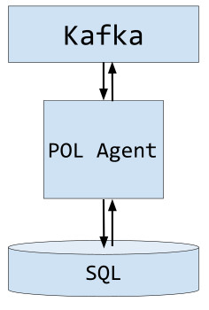

<!--
This file is part of OSM Policy Management module
All Rights Reserved to Whitestack, LLC

Licensed under the Apache License, Version 2.0 (the "License"); you may
not use this file except in compliance with the License. You may obtain
a copy of the License at

        http://www.apache.org/licenses/LICENSE-2.0

Unless required by applicable law or agreed to in writing, software
distributed under the License is distributed on an "AS IS" BASIS, WITHOUT
WARRANTIES OR CONDITIONS OF ANY KIND, either express or implied. See the
License for the specific language governing permissions and limitations
under the License.

For those usages not covered by the Apache License, Version 2.0 please
contact: bdiaz@whitestack.com or glavado@whitestack.com
-->
# Policy Management module (POL)

## Summary

POL accomplishes the following tasks:

* Configure auto scaling groups for VNFs.
* Configure VNF alarms for VNFs.
* Listen for MON alarms status and evaluating corresponding policies (scaling and vnf alarms).
* Sending scaling messages to LCM when scaling policy conditions are met.
* Calling webhooks when VNF alarm policies are met.

## Overview

POL has the following components:

* POL Agent: 
  * Listens to message bus for NS LCM actions (instantiation, scaling, deletion) and configures resources accordingly.
  * Listens to message bus for alarm notifications, evaluates policies and executes corresponding actions.

## POL Agent

POL subscribes to the message bus and waits for the following messages:

* topic: ns - key: instantiated
* topic: ns - key: scaled
* topic: ns - key: terminated
* topic: alarm_response - key: notify_alarm

When a NS is created, it checks the corresponding VNFDs for scaling group descriptors or vnf alarms. It creates the corresponding
resources in MON.
When a NS is scaled, it does the same as above for new VDUs if scaled out. It removes orphaned resources if scaled in.
When a NS is terminated, it deletes associated resources.

When an alarm is raised, if it corresponds to a scaling policy, it stores its last status and then validates the policy,
as policies can have N alarms related to them and can specify a boolean operator (AND/OR) to evaluate the conditions.
If it corresponds to a VNF alarm, the associated webhook is called.

Data is stored in POL database in the OSM MySQL engine.
